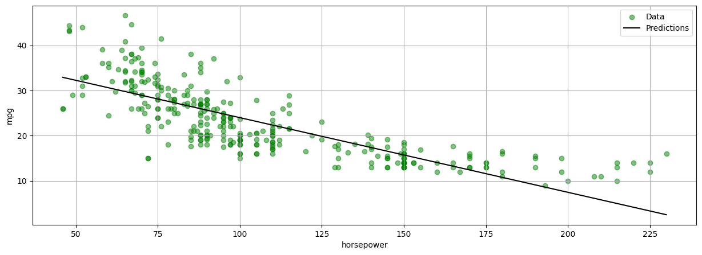
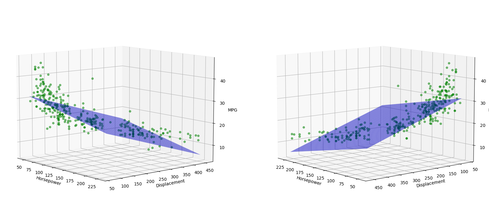
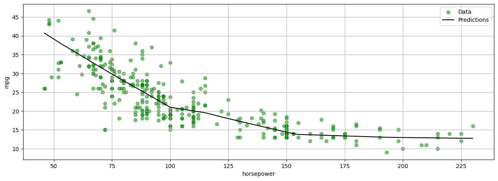
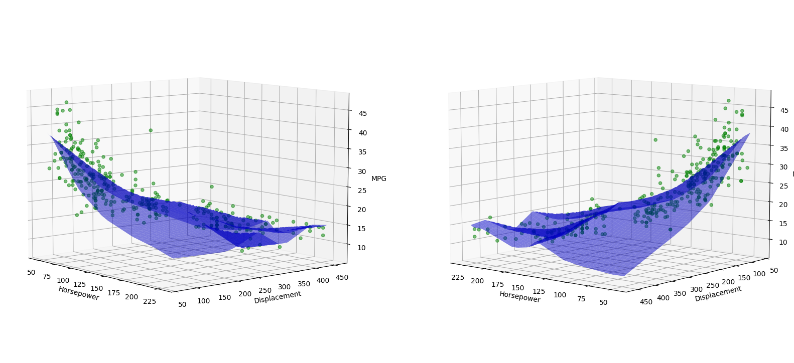
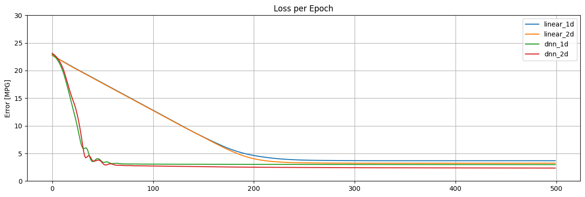

# Deep Learning with Auto-MPG Dataset

This project explores the application of deep learning techniques to predict city-cycle fuel consumption (in miles per gallon) using the Auto MPG dataset. The focus is on implementing and comparing various linear regression models using PyTorch.

## Dataset

The dataset used in this project is the **Auto MPG Dataset** from the UCI Machine Learning Repository.

- **Dataset Link:** [Auto MPG](https://archive.ics.uci.edu/dataset/9/auto+mpg)
- **Reference:** Quinlan, R. (1993). Auto MPG. UCI Machine Learning Repository. https://doi.org/10.24432/C5859H.

> "*The data concerns city-cycle fuel consumption in miles per gallon, to be predicted in terms of 3 multivalued discrete and 5 continuous attributes.*" - Quinlan, 1993

## Project Overview

The primary objective of this project is to build and evaluate linear regression models using PyTorch to predict miles per gallon (MPG) based on specific car features. The features used in the models are **horsepower** and **displacement**.

### Key Steps:

1. **Data Loading:** 
   - The dataset is loaded and prepared for training and testing.
   
2. **Data Processing:**
   - The features **horsepower** and **displacement** are extracted and scaled using standardization to ensure that they have a mean of 0 and a standard deviation of 1.

3. **Modeling:**
   - Four different linear regression models are implemented using PyTorch:
     - `linear_1d_model`: A 1-dimensional linear regression model using horsepower.
     
     

     - `linear_2d_model`: A 2-dimensional linear regression model using both horsepower and displacement.
     
     

     - `dnn_1d_model`: A 1-dimensional deep neural network model using horsepower.
     
     

     - `dnn_2d_model`: A 2-dimensional deep neural network model using both horsepower and displacement.
     
     
   
4. **Training & Testing:**
   - The models are trained on the processed dataset and evaluated on a test set. Metrics such as Mean Squared Error (MSE) are used to assess the performance of each model.

5. **Visualization:**
   - The performance of each model is visualized through various plots, showing the predicted MPG values against the actual values.

### Visualizations:

- **Model Predictions:**
  - Visualizations are provided to compare the predictions made by each model against the actual MPG values.
  
- **Model Performance:**
  - Plots are included to show how well each model fits the data.
 
 

## Requirements

To run the code in this project, you will need the following Python packages:

- `torch`
- `pandas`
- `numpy`
- `matplotlib`
- `scikit-learn`

Install the required packages using:

```bash
pip install torch pandas numpy matplotlib scikit-learn
```

## How to Run

1. Clone the repository:
   ```bash
   git clone https://github.com/yourusername/deep-learning-auto-mpg.git
   cd deep-learning-auto-mpg
   ```

2. Install the required packages:
   ```bash
   pip install -r requirements.txt
   ```

3. Run the Jupyter Notebook:
   ```bash
   jupyter notebook Deep_Learning_on_Auto_MPG.ipynb
   ```

## Results

The linear regression models implemented in this project offer insights into the relationships between the selected features and MPG. The use of both simple linear models and deep neural networks allows for a comprehensive comparison of different approaches. Visualization tools highlight the strengths and weaknesses of each model.

## Acknowledgments

This project is based on the Auto MPG dataset available from the UCI Machine Learning Repository. Special thanks to the creators and maintainers of the dataset.

## License

This project is licensed under the MIT License. See the [LICENSE](LICENSE) file for details.
